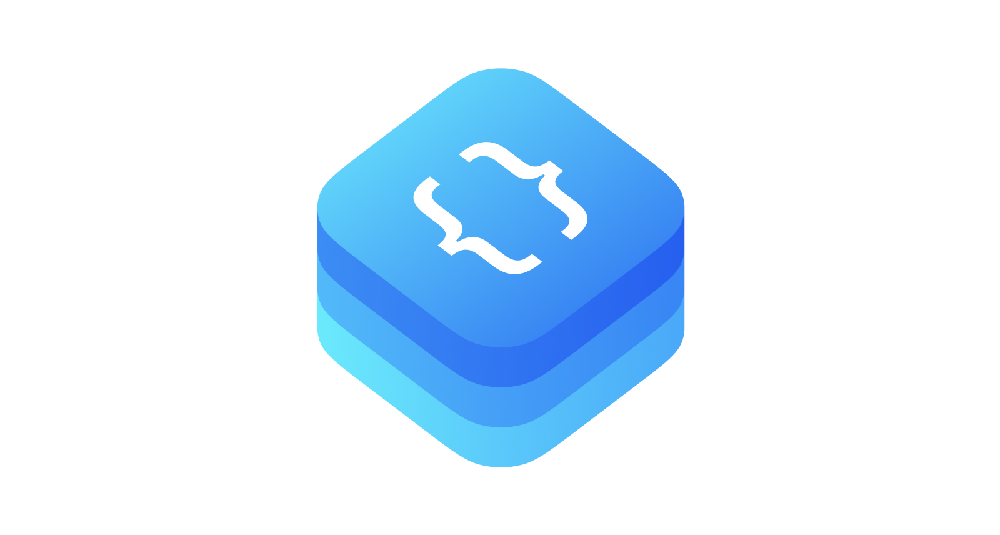

# Then

✨ Syntactic sugar for Swift

## Basics

Initialize UILabel **then** set its properties.

```swift
private let titleLabel = UILabel().then {
    $0.textAlignment = .center
    $0.adjustsFontSizeToFitWidth = true
    $0.transform = CGAffineTransform(rotationAngle: -.pi / 6)
}
```

This is the same as:

```swift
private let titleLabel: UILabel = {
    let titleLabel = UILabel()
    titleLabel.textAlignment = .center
    titleLabel.adjustsFontSizeToFitWidth = true
    titleLabel.transform = CGAffineTransform(rotationAngle: -.pi / 6)
    return titleLabel
}()
```

## Usage

- You can use `then()` to all of `NSObject` subclasses.

    ```swift
    let animation = CABasicAnimation(keyPath: "fillColor").then {
        $0.fromValue = fromColor.cgColor
        $0.toValue = toColor.cgColor
        $0.duration = duration
        $0.beginTime = CACurrentMediaTime() + delay
        $0.timingFunction = CAMediaTimingFunction(name: .easeOut)
    }
    ```

- You can make extensions for your own types.

    ```swift
    extension TransportType: Then {}
    
    let instance = TransportType.car.then {
        $0.availability = .full
    }
    ```

- Use `with()` when copying the value types.

    ```swift
    let frame = oldFrame.with {
        $0.size.width = 200
        $0.size.height = 100
    }
    frame.width  // will be 200
    frame.height // will be 100
    ```

- Use `do()` to do something with less typing.

    ```swift
    UserDefaults.standard.do {
        $0.set(username, forKey: .username)
        $0.set(email, forKey: .email)
        $0.synchronize()
    }
    ```

## Real World Example

Here's an example usage in a real project.

```swift
// MARK: - NotificationsCell

final class NotificationsCell: UITableViewCell {

    // MARK: - Properties

    /// Container
    private let containerView = UIView()

    /// Notification image view
    private let notificationImageView = UIImageView().then {
        $0.image = Asset.Avatar.avatarPlaceholder.image
        $0.contentMode = .scaleAspectFill
    }

    /// Notification title label
    private let titleLabel = UILabel().then {
        $0.setContentHuggingPriority(.defaultHigh, for: .horizontal)
        $0.setContentCompressionResistancePriority(.defaultLow, for: .horizontal)
        $0.numberOfLines = LayoutConstants.titleNumberOfLines
    }

    /// Notification subtitle label
    private let subtitleLabel = UILabel().then {
        $0.numberOfLines = LayoutConstants.subtitleNumberOfLines
    }

    /// Date of notification completion label
    private let dateLabel = UILabel().then {
        $0.setContentHuggingPriority(.defaultLow, for: .horizontal)
        $0.setContentCompressionResistancePriority(.defaultHigh, for: .horizontal)
        $0.textAlignment = .right
    }
    
    ...
}
```

## Installation

- **Using  [CocoaPods](https://cocoapods.org)**:

    ```ruby
    pod 'incetro-then'
    ```

- **Using [Swift Package Manager](https://swift.org/package-manager)**:

    ```swift
    import PackageDescription

    let package = Package(
        name: "MyAwesomeApp",
        dependencies: [
            .package(url: "https://github.com/Incetro/Then", .branch("main")),
        ]
    )
    ```

## License

**Then** is under MIT license. See the [LICENSE](LICENSE) file for more info.
